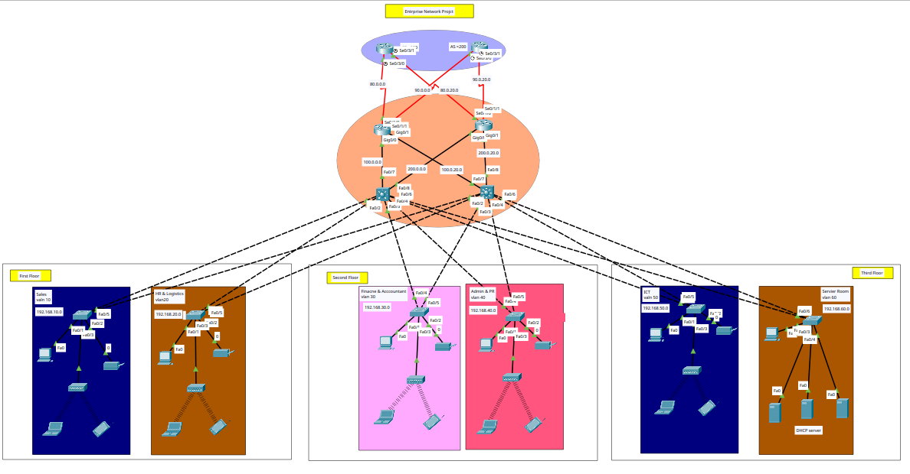

# 🏢 Enterprise Network Design & Implementation

> A fully configured enterprise network built in Cisco Packet Tracer, implementing industry-standard technologies across a hierarchical 3-tier architecture with dual-ISP redundancy, dynamic routing, security hardening, and wireless access.

---

## 📸 Network Topology



---

## 🧰 Technologies Implemented

| Category | Technology |
|---|---|
| Network Design | Hierarchical 3-Tier (Core / Distribution / Access) |
| WAN | Dual ISP, Serial links, PPP encapsulation with CHAP authentication |
| Dynamic Routing | OSPF (internal), BGP (edge — AS 65001 ↔ AS 100 / AS 200) |
| VLANs | 6 VLANs with 802.1Q trunking |
| Inter-VLAN Routing | Layer 3 SVI (Switch Virtual Interface) |
| IP Addressing | Static IPv4 for infrastructure, DHCP for end devices |
| DHCP | Centralized DHCP server (Server Room) with IP helper-address relay |
| NAT | NAT Overload / PAT on edge routers |
| Security | SSH v2, Port Security (sticky MAC), ACLs |
| Layer 2 Security | DHCP Snooping, Dynamic ARP Inspection (DAI) |
| Wireless | WLAN access points with WPA2-PSK per department |

---

## 🗺️ Network Architecture

```
                    [ ISP1 - AS100 ]   [ ISP2 - AS200 ]
                           |   \       /   |
                      BGP  |    \     /    |  BGP
                           |     \   /     |
                        [ R1 ]         [ R2 ]
                        PPP/CHAP     PPP/CHAP
                           |    \   /    |
                      OSPF |     \ /     | OSPF
                           |      X      |
                    [ L3-SW1 ]       [ L3-SW2 ]
                    SVI routing       SVI routing
                    /    |    \      /    |    \
               VLAN10  VLAN30  VLAN50  VLAN20  VLAN40  VLAN60
               Sales   Finance  ICT    HR     Admin   Servers
```

---

## 🏗️ Floor & VLAN Layout

### First Floor
| Department | VLAN | Subnet | Gateway |
|---|---|---|---|
| Sales | 10 | 192.168.10.0/24 | 192.168.10.1 |
| HR & Logistics | 20 | 192.168.20.0/24 | 192.168.20.1 |

### Second Floor
| Department | VLAN | Subnet | Gateway |
|---|---|---|---|
| Finance & Accountant | 30 | 192.168.30.0/24 | 192.168.30.1 |
| Admin & PR | 40 | 192.168.40.0/24 | 192.168.40.1 |

### Third Floor
| Department | VLAN | Subnet | Gateway |
|---|---|---|---|
| ICT | 50 | 192.168.50.0/24 | 192.168.50.1 |
| Server Room | 60 | 192.168.60.0/24 | 192.168.60.1 |

---

## 🌐 WAN IP Addressing

| Link | Device | Interface | IP Address |
|---|---|---|---|
| ISP1 ↔ R1 | ISP1 | Se0/3/0 | 80.0.0.11/24 |
| ISP1 ↔ R1 | R1 | Se0/1/0 | 80.0.0.10/24 |
| ISP1 ↔ R2 | ISP1 | Se0/3/1 | 80.0.20.11/24 |
| ISP1 ↔ R2 | R2 | Se0/1/0 | 80.0.20.10/24 |
| ISP2 ↔ R1 | ISP2 | Se0/3/0 | 90.0.0.11/24 |
| ISP2 ↔ R1 | R1 | Se0/1/1 | 90.0.0.10/24 |
| ISP2 ↔ R2 | ISP2 | Se0/3/1 | 90.0.20.11/24 |
| ISP2 ↔ R2 | R2 | Se0/1/1 | 90.0.20.10/24 |

---

## 🔐 Security Features

### SSH v2
- RSA 2048-bit keys on all routers and switches
- VTY lines restricted to SSH only (`transport input ssh`)
- Local user authentication (`privilege 15`)
- Auto-timeout after 5 minutes idle

### Port Security
- Maximum 1 MAC address per access port
- Sticky MAC learning
- Violation mode: `shutdown`

### ACLs
- Extended ACLs controlling inter-VLAN traffic
- Restricts unauthorized department-to-department access
- Applied inbound on SVI interfaces

### DHCP Snooping
- Enabled on all access VLANs
- Uplink trunk ports marked as trusted
- Prevents rogue DHCP servers

### Dynamic ARP Inspection (DAI)
- Validates ARP packets against DHCP snooping binding table
- Drops spoofed ARP responses
- Protects against ARP poisoning / Man-in-the-Middle attacks

---

## 📡 Wireless (WLAN)

| Department | SSID | Security | VLAN |
|---|---|---|---|
| sales | sales-WiFi | WPA2-PSK | 10 |
| HR & Logistics | HR-WiFi | WPA2-PSK | 20 |
| Finance & Accountant | Finance-WiFi | WPA2-PSK | 30 |
| Admin & PR | Admin-WiFi | WPA2-PSK | 40 |
| ICT | ict-WiFi | WPA2-PSK | 50 |

Wireless clients (laptops, smartphones) receive IPs via DHCP from the centralized server through IP helper-address relay.

---

## 🔄 Routing Design

### OSPF (Area 0 — Internal)
- Runs between R1, R2, and both L3 core switches
- Advertises all 6 VLAN subnets
- Serial interfaces set as `passive-interface` (no OSPF hellos toward ISPs)
- `default-information originate` pushes default route to all internal devices

### BGP (Edge — Dual ISP)
- R1: peers with ISP1 (AS 100) directly + ISP2 (AS 200) cross-link
- R2: peers with ISP2 (AS 200) directly + ISP1 (AS 100) cross-link
- Provides full dual-ISP redundancy
- If one ISP fails, BGP automatically shifts all traffic to the other

### NAT Overload (PAT)
- All private VLAN subnets translated to public serial interface IP
- Applied on both serial interfaces of R1 and R2
- ACL `NAT_ACL` defines what gets translated

---

## 🚀 How to Open

1. Install [Cisco Packet Tracer](https://www.netacad.com/courses/packet-tracer) (version 8.0 or later recommended)
2. Clone this repository:
   ```bash
   git clone https://github.com/thisishisham1/enterprise-network.git
   ```
3. Open `enterprise.pkt` in Packet Tracer
4. Use Simulation mode to trace packet flow across VLANs and to the internet

---

## ✅ Verification Commands

```bash
# Routing table
show ip route

# BGP neighbors
show bgp summary

# OSPF neighbors
show ip ospf neighbor

# NAT translations
show ip nat translations

# VLAN status
show vlan brief

# SVI interfaces
show ip interface brief

# Port security
show port-security interface fa0/1

# DHCP snooping
show ip dhcp snooping binding

# ARP inspection
show ip arp inspection

# SSH status
show ip ssh
```

---

## 👨‍💻 Author

**Hisham** — Computer Science Graduate, 6 October University (2024)

- 🔗 GitHub: [github.com/thisishisham1](https://github.com/thisishisham1)
- 📍 Egypt

---

## 📜 License

This project is open source and available under the [MIT License](LICENSE).
